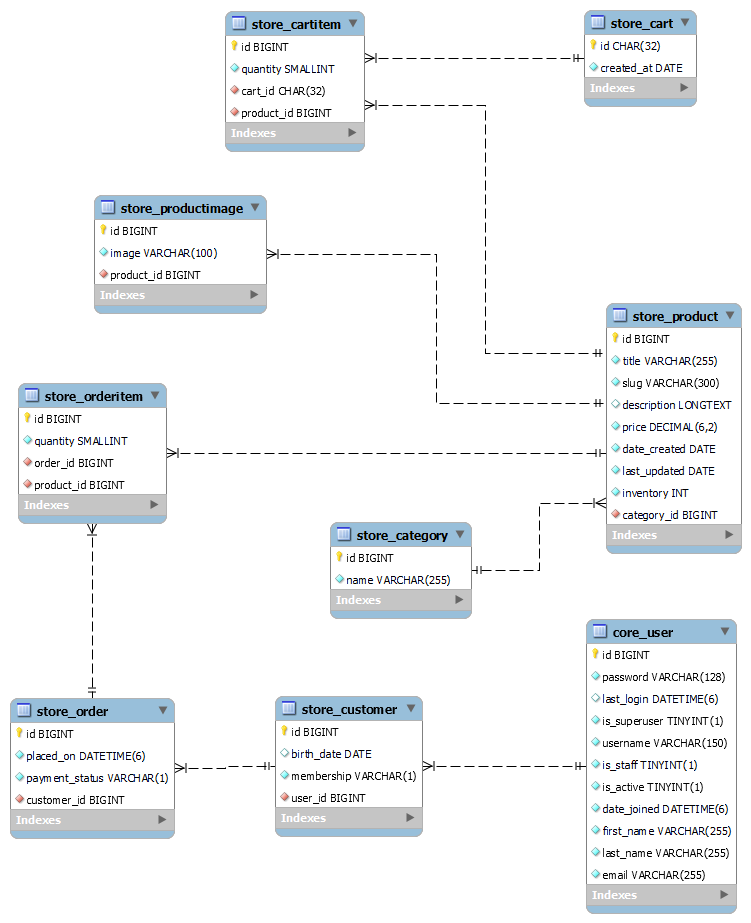
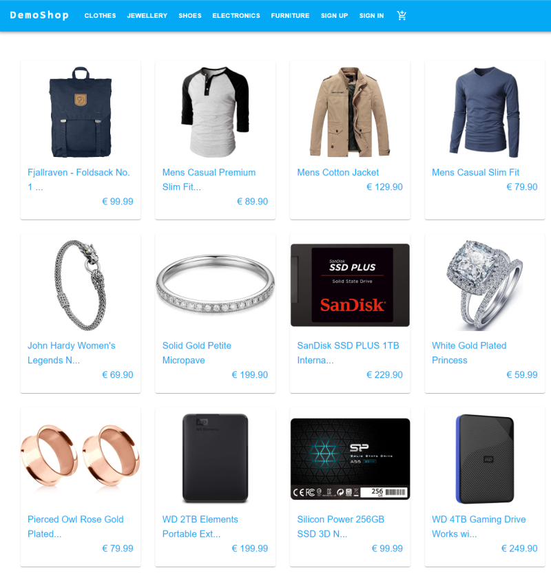
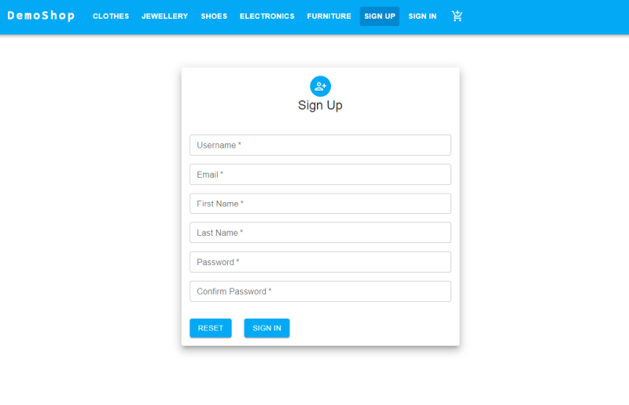
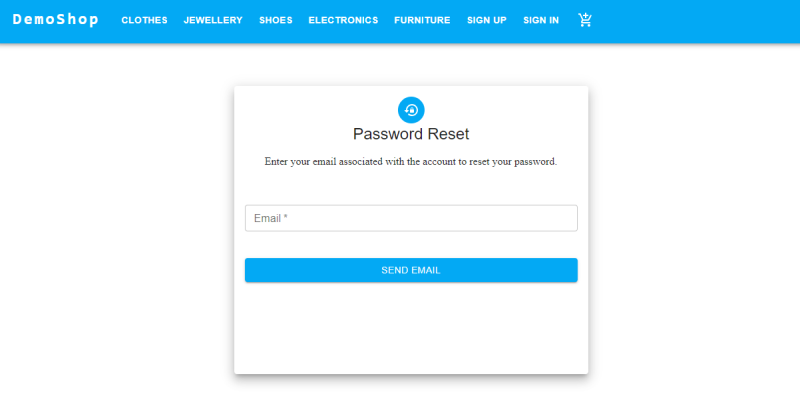
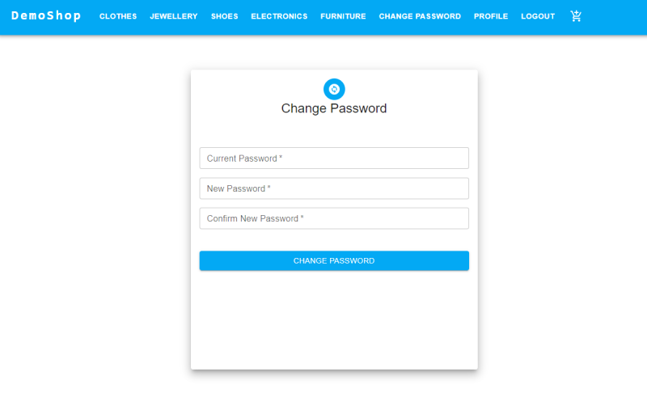
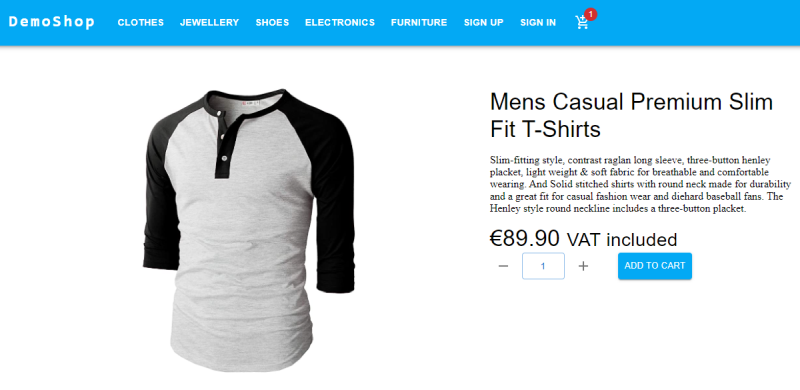
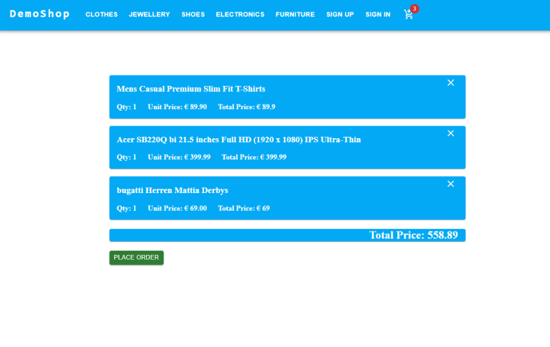

## Django-store-app
I created this store app to help me improve my django skills by making a project. 

Key features of the app:  
    - E-commerce platform (REST API) with backend development using <i>Django Rest Framework</i>. 
    - Frontend development using <em>React JS</em> 
    - Implementation of token-based authentication using <em>Djoser</em> and <em>Simple JWT</em>.  

You can run the store app locally on your system. You need to follow these steps:

1. Install <em>docker</em> (preferred version 4.22.0) on your system.  
2. Clone the repository.  
`git clone git@github.com:yogesh-shrestha/django-store-app.git`
3. Change directory.  
    `cd django-store-app/api`
4. build docker images and run.  
    `docker-compoose up --build`  

Development server starts at `http://localhost:8000/`. Fake SMTP Server starts in local server at (`http://localhost:5000/`) which is used for testing email sending tasks during development (https://github.com/rnwood/smtp4dev). If database is not prepopulated with dummy data for some reasons, run `docker-compose run djangoapi python manage.py seed_db`.

<b>Superuser credentials </b>  
username: admin 
password: admin 
 

### Entity-Relationship Diagram

### Overview of store app
- Home Page  

- User can sign up for membership. An email with activation link is sent to the user after sign up. User must click the link and follow the instruction to activate the account.

- User can reset password. An email with reset link is sent to the user. User must click the link to reset password.

- User can change password.

- User can add products to the cart.

- User can view own cart.
